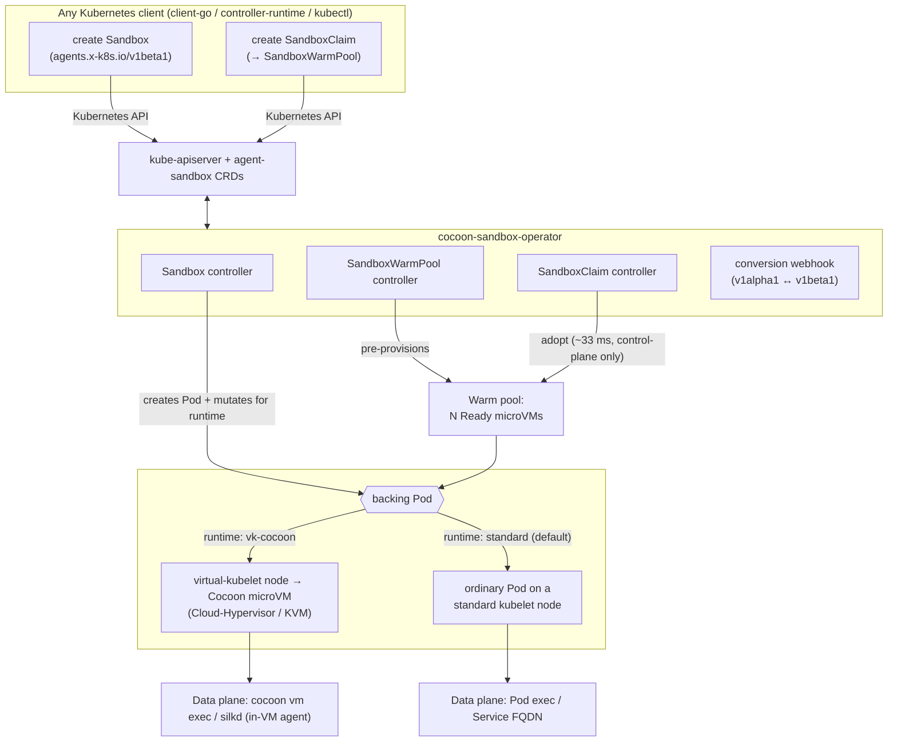
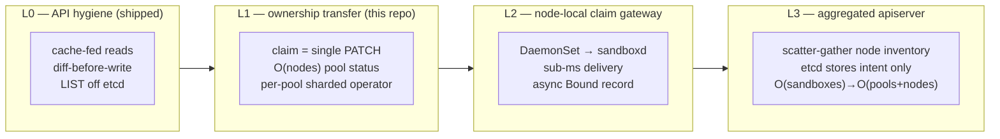

# cocoon-sandbox-operator

A Kubernetes operator for **fast, warm-poolable agent sandboxes backed by real
microVMs**. It implements the [`kubernetes-sigs/agent-sandbox`](https://github.com/kubernetes-sigs/agent-sandbox)
API in full and is driven **entirely through the standard Kubernetes API** — no
proprietary SDK. A pre-warmed sandbox is acquired in **~33 ms at p50**, below
e2b's published ~150 ms sandbox start, and each sandbox is a genuine
Cloud-Hypervisor/KVM microVM, not a shared-kernel container (see
[PERFORMANCE.md](PERFORMANCE.md)).

You create an `agents.x-k8s.io` `Sandbox` with any Kubernetes client; the
operator schedules it, and with the `vk-cocoon` runtime the backing Pod is
materialized as a [Cocoon](https://github.com/cocoonstack/cocoon) microVM on a
virtual-kubelet node. A portable **standard-kubelet** backend (ordinary Pods, any
conformant cluster) is also available for environments without the microVM
substrate.

## Why

| | |
|---|---|
| ✅ **Standards-compliant** | Implements the complete `agents.x-k8s.io` `Sandbox` (v1alpha1 + v1beta1) API and the `extensions.agents.x-k8s.io` `SandboxTemplate` / `SandboxWarmPool` / `SandboxClaim` API from [kubernetes-sigs/agent-sandbox](https://github.com/kubernetes-sigs/agent-sandbox), including conversion webhooks, lifecycle, status/conditions, PVCs, Services, and NetworkPolicy. |
| ✅ **Pure Kubernetes SDK** | Create and manage sandboxes with any Kubernetes client — [`client-go`](https://github.com/kubernetes/client-go), [`controller-runtime`](https://github.com/kubernetes-sigs/controller-runtime), `kubectl`, or the client library of any language. The control plane is 100% Kubernetes CRDs. |
| ✅ **Real microVM isolation** | With `vk-cocoon`, each sandbox is a hardware-isolated Cloud-Hypervisor/KVM guest via [vk-cocoon](https://github.com/cocoonstack/vk-cocoon) + [cocoon](https://github.com/cocoonstack/cocoon) — not a shared-kernel container. Warm claims stay Kubernetes-native. |
| ✅ **Faster than hosted microVM services** | Pre-warmed claim p50 **~33 ms** (real microVM) vs e2b's published ~150 ms. Validated to a warm pool of **thousands of concurrent microVMs**. Full numbers and methodology in [PERFORMANCE.md](PERFORMANCE.md). |

## Architecture



- **Cold path:** a `Sandbox` (or `SandboxClaim` with no warm pool) creates a Pod
  on demand; with `vk-cocoon` the Pod boots a microVM.
- **Warm path:** a `SandboxWarmPool` keeps N microVMs Ready; a `SandboxClaim`
  *adopts* one instantly (control-plane only — the microVM is already booted),
  then the warm pool replenishes in the background. This is the ~33 ms path.
- **Deeper tier:** the [`cocoonstack/sandbox`](https://github.com/cocoonstack/sandbox)
  runtime this builds on has a node-local `sandboxd` warm pool whose claims are
  **0.2–0.7 ms** (VM ownership transfer) via its own Go/Python SDK — use it when
  you want sub-millisecond claims outside the Kubernetes control plane.

## API coverage

| API | Implemented semantics |
|---|---|
| `agents.x-k8s.io/v1beta1` **Sandbox** | Pod, PVC, optional headless Service, status/conditions, suspend/resume, expiry & shutdown policy, resource adoption, metadata propagation, dual-stack status, v1alpha1 conversion |
| `extensions.agents.x-k8s.io/v1beta1` **SandboxTemplate** | reusable blueprints, managed/unmanaged NetworkPolicy, secure defaults, env & PVC injection policy, conversion |
| `extensions.agents.x-k8s.io/v1beta1` **SandboxWarmPool** | desired/ready capacity, `scale` subresource, template-drift & update strategies, warm replenishment, conversion |
| `extensions.agents.x-k8s.io/v1beta1` **SandboxClaim** | atomic warm adoption, cold fallback, lifecycle & finished TTL, foreground deletion, metadata/env/PVC injection, conversion |

v1beta1 is the storage version; v1alpha1 remains served via conversion webhooks.
Upstream provenance and the pinned revision are in [UPSTREAM.md](UPSTREAM.md).

## Use it with the Kubernetes SDK

Typed (controller-runtime), or `unstructured` / dynamic client if you don't want
to vendor the types:

```go
import (
    sandboxv1beta1 "github.com/doge-rgb/cocoon-sandbox-operator/api/v1beta1"
    "sigs.k8s.io/controller-runtime/pkg/client"
)

sb := &sandboxv1beta1.Sandbox{
    ObjectMeta: metav1.ObjectMeta{Name: "demo", Namespace: "default"},
    Spec: sandboxv1beta1.SandboxSpec{
        SandboxBlueprint: sandboxv1beta1.SandboxBlueprint{
            PodTemplate: sandboxv1beta1.PodTemplate{
                // Opt into a real microVM; omit for the portable standard-kubelet backend.
                ObjectMeta: sandboxv1beta1.PodMetadata{
                    Annotations: map[string]string{"sandbox.cocoonstack.io/runtime": "vk-cocoon"},
                },
                Spec: corev1.PodSpec{
                    Containers: []corev1.Container{{Name: "agent", Image: "ghcr.io/cocoonstack/cocoon/ubuntu:24.04"}},
                },
            },
        },
    },
}
_ = c.Create(ctx, sb) // standard client-go / controller-runtime client
```

Or plain YAML:

```yaml
apiVersion: agents.x-k8s.io/v1beta1
kind: Sandbox
metadata: { name: demo, namespace: default }
spec:
  podTemplate:
    metadata:
      annotations: { sandbox.cocoonstack.io/runtime: vk-cocoon }   # real microVM
    spec:
      containers:
        - { name: agent, image: ghcr.io/cocoonstack/cocoon/ubuntu:24.04 }
```

For low-latency acquisition, define a `SandboxTemplate` + `SandboxWarmPool` and
create `SandboxClaim`s — see [examples/](examples/).

### Lifecycle: pause, resume, fork, snapshot

Beyond create/delete, a delivered sandbox supports four action verbs, served as
**subresources** so the standard `agents.x-k8s.io` schema stays untouched (an
unmodified upstream client keeps working):

| subresource | body | effect |
|---|---|---|
| `sandboxes/pause` | `SandboxPauseOptions` | snapshots guest memory and stops the VM |
| `sandboxes/resume` | `SandboxResumeOptions` | restores it via cocoon's mmap fast path |
| `sandboxes/fork` | `SandboxForkOptions{count,ttlSeconds}` | branches N children; the source keeps running |
| `sandboxes/snapshot` | `SandboxSnapshotOptions{name}` | captures a checkpoint later sandboxes branch from |

```bash
kubectl create --raw \
  /apis/agents.x-k8s.io/v1beta1/namespaces/default/sandboxes/my-sandbox/snapshot \
  -f - <<<'{"apiVersion":"agents.x-k8s.io/v1beta1","kind":"SandboxSnapshotOptions","name":"before-migration"}'
```

**These verbs are not uniformly fast.** `resume` takes cocoon's mmap restore
path and a fork's children clone node-locally, but `pause` and `snapshot` write
the guest's memory out, so they cost time proportional to its size. Where a
checkpoint lives, and what happens when its node cannot serve a branch, is in
[docs/snapshot-placement.md](docs/snapshot-placement.md).

### Runnable walk-through

[`examples/lifecycle/example.go`](examples/lifecycle/example.go) exercises
**every** operation on **both** surfaces against a live cluster — create, get,
list, snapshot, fork, pause, resume, delete over the Kubernetes API, then the
same lifecycle plus templates, metrics, snapshot listing, timeout and keepalive
over the e2b REST API:

```bash
go run ./examples/lifecycle \
  -kubeconfig ~/.kube/config -namespace default \
  -e2b-url http://localhost:8080 -e2b-key "$E2B_API_KEY"
```

It discovers a template from the fleet's advertised warm pools, so no image
argument is needed. Omit `-e2b-url` to run only the Kubernetes half. Each step
prints what it did, so the output doubles as acceptance evidence:

```
=== Kubernetes API ===
  create     Sandbox default/example-219526000
  get        node=sandbox-node-01 claimID=sb_77ace349e7cc1db6
  snapshot   snapshotID=ck_92799687f14e8fea on node=sandbox-node-01
  fork       child[0] sandboxID=sb_06d1b2438dcc1d1b node=sandbox-node-01
  pause      took 315ms (proportional to guest memory)
  resume     took 109ms (mmap restore fast path)

=== e2b-compatible REST API ===
  create     sandboxID=sb-175124667cfa1281 envdVersion=0.4.0
  metrics    cpuCount=1 memTotal=5.36870912e+08
  pause      409 on repeat — the already-paused contract holds
  connect    201 — restored via the mmap fast path
```

Two behaviors it demonstrates deliberately, because callers must handle them:

- **Reads are eventually consistent.** `Create` returns as soon as the
  node-local claim completes, but `List`/`Get` are served from `NodeInventory`,
  which nodes republish on a ~30s cadence — so a read immediately after a
  create legitimately returns `NotFound`. The example polls; so should you.
- **The published sandbox id is DNS-label safe.** The e2b SDK builds the
  in-sandbox host as `{port}-{sandboxID}.{domain}`, so the node's raw claim id
  (`sb_...`) is rendered as `sb-...` on the e2b surface.

## Use it with the e2b SDK

The aggregated apiserver can also serve an e2b-compatible REST surface, so an
**unmodified e2b SDK** claims from these same warm pools — point `E2B_API_URL`
at it:

```bash
sandbox-apiserver --enable-e2b-api --e2b-api-key-file=/etc/e2b/keys
```

```js
export E2B_API_URL=https://your-apiserver:8080
const sandbox = await Sandbox.create('registry.example.com/rt:24.04')
```

It is a translation layer, not a second control plane: an e2b create is the same
node-local claim, and the sandbox stays visible to `kubectl get sandboxes`. Flags,
endpoint mapping, and limits in [docs/e2b-compat.md](docs/e2b-compat.md).

[`examples/lifecycle/example.go`](examples/lifecycle/example.go) drives this
surface end to end — create, get, list, metrics, snapshot, fork, pause, resume,
timeout, keepalive, delete — asserting the status codes the SDKs rely on (409 on
a repeated pause, 201 versus 200 on `connect`). It speaks the REST contract
directly rather than importing an SDK, because e2b publishes JS and Python
clients but no Go one; that exercises the wire contract, not the SDKs
themselves.

[`examples/lifecycle/example-e2b.py`](examples/lifecycle/example-e2b.py) closes
that gap by importing the real `e2b` package from PyPI, unmodified, and running
the same lifecycle plus a 100-sandbox concurrent pass. Two deployment facts it
had to encode, both worth knowing before pointing a real client here:

- **`allow_internet_access` selects the warm pool, and the SDK defaults it to
  `True`.** True picks the egress network lane; the pools this repo benchmarks
  are on the no-egress lane, so the SDK's *default* create answers 503 "no warm
  sandbox available". Pass `allow_internet_access=False`, or provision an
  egress-lane `SandboxWarmPool`.
- **The SDK does not poll for read-view visibility.** Create returns as soon as
  the node-local claim completes, but every other verb resolves through the
  synthesized view, so `create` immediately followed by `pause` raises
  `SandboxNotFoundException` until the owning node republishes. The example
  polls with ordinary SDK calls; the fix that removes the window is the
  [L3 follow-up](#l3-follow-up-resolve-a-sandbox-without-the-summary-todo).

Data-plane methods (`is_running`, `commands`, `files`, `pty`) reach envd inside
the guest at `{port}-{id}.{domain}`, which needs `--e2b-domain` plus wildcard DNS
routed to the sandboxes; the example does not exercise them.

## Install

Helm:

```bash
helm upgrade --install cocoon-sandbox-operator ./helm \
  --namespace cocoon-sandbox-system --create-namespace \
  --set image.tag=<version>
```

Kustomize (replace the `ko://` image reference):

```bash
kustomize build k8s | sed 's#ko://.*/cocoon-sandbox-operator#ghcr.io/doge-rgb/cocoon-sandbox-operator:<version>#' | kubectl apply -f -
```

The default (standard-kubelet) backend needs no special nodes. The `vk-cocoon`
backend requires [vk-cocoon](https://github.com/cocoonstack/vk-cocoon) virtual
nodes. See [docs/migration-from-mindos.md](docs/migration-from-mindos.md) for a
safe, no-double-write rollout alongside an existing installation.

## Runtime backends

Standard kubelet is the default. To place a sandbox on the `vk-cocoon` microVM
backend, set the Pod-template annotation
`sandbox.cocoonstack.io/runtime: vk-cocoon`; the adapter adds only the missing
scheduling fields (`node.kubernetes.io/instance-type=virtual-node`, the provider
toleration, and the `cocoonset.cocoonstack.io/*` boot annotations) and rejects
(never overwrites) conflicting explicit values. See
[docs/runtime-backends.md](docs/runtime-backends.md).

To pin sandboxes to specific nodes (for example, microVM hosts with fast local
NVMe/xfs storage), label those nodes and set a `nodeSelector` in the Pod template
or `SandboxTemplate`; the operator never mutates user-supplied scheduling.

## Performance

Summary (full methodology in [PERFORMANCE.md](PERFORMANCE.md), measured on a live
27-node microVM cluster via the Kubernetes SDK):

- **Warm-pool claim (real microVM):** p50 **~33 ms**, p95 ~39 ms, 100% warm hits
  — below e2b's published ~150 ms sandbox start, and holds constant as the pool
  grows from 10 to 2000+ sandboxes.
- **Scale:** a single `SandboxWarmPool` of thousands of concurrent microVMs; CR
  creation ~36/s, microVM boot ~27/s at scale; 0 operator restarts; production
  microVMs on the same cluster unaffected; clean scale-to-0 with 0 stuck
  finalizers.
- **Deeper tier:** the underlying `cocoonstack/sandbox` `sandboxd` warm pool
  claims in **0.2–0.7 ms** (its own published benchmarks) for use cases that can
  adopt its non-Kubernetes data plane.

### Fleet benchmark: 50 000 microVMs from one `kubectl patch`

The numbers above are single-node / small-pool. The question at fleet scale is
different: *how long does one `kubectl` command take to stand up 50 000
claimable sandboxes?* Driven by nothing but a standard CRD write —

```bash
kubectl patch sandboxwarmpool wp-speed -p '{"spec":{"replicas":50000}}'
```

— on **20 bare-metal nodes** (384 vCPU / 1.5 TiB / local NVMe, 2 500 microVMs
per node), the whole fleet reaches full supply in **10–15 s**: an effective
**3 300–5 000 sandboxes/s**, at **99 MB net RAM per microVM**, with claim
latency holding at **p50 12 ms**. All figures are measured on real
Cloud-Hypervisor/KVM microVMs through the Kubernetes API — node telemetry
sampled at 5 s, CR `status` polled at 1 s.

| Metric | Value | Basis |
|---|---|---|
| Target | **50 000** microVMs | `SandboxWarmPool` `replicas: 0→50000`, one patch |
| Fleet | 20 bare metal | 384 vCPU / 1.5 TiB / local NVMe · 2 500 per node |
| Fill time | **10–15 s** (node telemetry) · 15.7 s (CR wall-clock) | node side at 5 s granularity; CR adds a ≤5 s status-sampling lag |
| Effective supply | **3 300–5 000 /s** | 50 000 ÷ node-side fill window; CR steady-state 3 654/s |
| Per-node rate | 170–270 /s | the node-local constant *r* (see scaling law below) |
| RAM / microVM | **99 MB** | `MemAvailable` delta ÷ live count |
| Claim latency | p50 **12 ms** (claim) · 40 ms (create→exec) | upstream `agent-sandbox` Go SDK, 5 000 claims, 0 leaked |

#### Supply: 0 → 50 000 ready


*Same command, same target, three engine configs. Round 1 eager-copy recovery
**172.7 s**; round 2 mmap-CoW **290.1 s** — one HDD-backed node dominates the
tail; round 3 on 20 homogeneous NVMe nodes **12 ± 3 s**. An 11–18× speedup, all
of it from the data-plane and control-plane changes below.*

<table>
<tr>
<td></td>
<td></td>
</tr>
</table>

*Left: fleet-wide warm count ramping 0 → 50 000 (live `sandboxd` telemetry).
Right: per-node fill — every node climbs to its 2 500 share in the same window.
That zero-coupling is what makes cluster rate = N × node rate.*


*Round-3 `status.readyReplicas`: first visible at t+4.8 s (19 193, the first 5 s
batch), 50 000 at t+15.7 s — the status-sampling lag on top of the ~10 s
physical fill.*

#### Memory: mmap CoW brings each microVM to 99 MB


*Recovery defaults from eager copy (each clone privately copies guest RAM) to
mmap copy-on-write (clones share one file-backed golden page cache; pages
privatize on first write). Same golden, same pool, same instant: per-VM CH RSS
**359 MB → 163 MB**, net per-VM footprint **358 MB → 99 MB** (3.6×), so a
1 923-VM node holds **672 G → 186 G**. The gain's sign is set by the storage
medium — mmap trades RAM for page-faults, so it needs NVMe (the round-2 tail is
the HDD counter-example).*

#### Claim latency through the official SDK

Claiming a warm sandbox is control-plane only — the microVM is already running —
so it is one Kubernetes round-trip with **no etcd write on the claim path**.
Measured with the upstream `agent-sandbox` Go client (not a private SDK), 5 000
claims at a steady 2/s, in-cluster:

| Path | avg | p50 | p90 | p95 | p99 |
|---|---|---|---|---|---|
| **claim** (k8s API round-trip) | 11 ms | **12 ms** | 15 ms | 16 ms | 23 ms |
| create→exec (+ one vsock exec) | 33 ms | 40 ms | 59 ms | 62 ms | 64 ms |


Under a 2 → 100/s open-loop ramp from an off-cluster client (11 220 claims, **0
failed, 0 leaked**) the claim p50 stays flat to ~50/s; the knee is the client's
own ceiling, not a server rejection (the off-cluster network hop lifts the
in-cluster 12 ms p50 to ~32 ms):

| target | procs | actual | avg | p50 | p99 |
|---|---|---|---|---|---|
| 2/s | 1 | 1.9/s | 17.4 ms | 32 ms | 64 ms |
| 20/s | 4 | 18.5/s | 17.4 ms | 32 ms | 32 ms |
| 50/s | 5 | 42.8/s | 20.2 ms | 32 ms | 64 ms |
| 100/s | 10 | 81.9/s | 28.5 ms | 32 ms | 128 ms |

#### Why it scales: etcd is not on the path

Supply is fully node-local — golden image, 256-way refill budget and SQLite
metadata all live on the node, and the control plane's only per-node
interaction is one O(1) `PUT /v1/pools` every 5 s. Sandbox objects never touch
etcd: the aggregated apiserver synthesizes them from a per-node `NodeInventory`
(published every 30 s, O(nodes)) plus a handful of `SandboxWarmPool`s
(O(pools)), so across the entire 50 k run etcd sees **~2 writes/s, independent of
sandbox count**.


*Supply time is T(S, N) ≈ T₀ + S / (N · r): a node-local constant r ≈ 250/s and
a control-plane constant T₀ ≈ 5–6 s. The 20-node / 50 000 point is measured
(15.7 s); with r and the O(N) control-plane budget both established, 200
homogeneous nodes extrapolate to ~1 000 000 microVMs in ≈25 s — the same
delivery curve, scaled linearly.*

The full methodology, per-round raw sampling, and the memory-accounting ledger
are in [PERFORMANCE.md](PERFORMANCE.md).

### Lifecycle latency across both surfaces

Everything above measures one verb: claim. Orchestrating a sandbox also means
pausing, resuming, snapshotting and forking it, and the cluster serves that whole
set on two surfaces at once — the Kubernetes API, and an e2b-compatible REST
surface that lets an unmodified e2b SDK drive the same warm pools by pointing
`E2B_API_URL` at it.

The two differ in expression, not capability. On the Kubernetes side, claim,
query and release are upstream `agent-sandbox` Sandbox semantics; the four verbs
upstream does not define are action subresources on Sandbox (the `pods/eviction`
shape), so they stay in the ordinary Kubernetes request pipeline with authz,
audit and admission intact. The e2b side answers the e2b REST contract exactly,
down to the semantics its SDKs depend on: a repeated pause returns 409 rather
than an error, and `connect` returns 201 when it actually restored from a
snapshot versus 200 when the sandbox was already running.

| Verb | Kubernetes API | e2b-compatible REST |
|---|---|---|
| Claim / release | standard Sandbox `create` / `delete` | `POST /sandboxes`, `DELETE /sandboxes/{id}` |
| Query | standard `get` / `list`, label and field selectors | `GET /sandboxes`, `GET /sandboxes/{id}` |
| Pause | `sandboxes/pause` subresource | `POST /sandboxes/{id}/pause`, 409 on repeat |
| Resume | `sandboxes/resume` subresource, idempotent | `POST /sandboxes/{id}/connect`, 201 restored / 200 already running |
| Snapshot | `sandboxes/snapshot` subresource | `POST /sandboxes/{id}/snapshots`, `GET /snapshots` |
| Fork | `sandboxes/fork` subresource | `POST /sandboxes/{id}/fork` |
| Templates | `SandboxTemplate` CRD | `GET /templates` |
| Metrics | node-side Prometheus endpoint | `GET /sandboxes/{id}/metrics` |
| Keepalive | sandbox TTL and `SandboxClaim` | `POST /sandboxes/{id}/timeout`, `/refreshes` |

**Measurement caliber.** The client below sits on a developer machine reaching
the cluster over the public internet, so every number includes one client↔cluster
round trip: these are latencies *as observed from outside the cluster*, not the
in-cluster figures quoted earlier.

| Verb | e2b p50 | e2b p95 | K8s p50 | K8s p95 |
|---|---|---|---|---|
| **Resume** (mmap fast path) | **183 ms** | 202 ms | **209 ms** | 222 ms |
| Pause (writes guest memory out) | 456 ms | 510 ms | 447 ms | 566 ms |
| Fork (includes one snapshot) | 474 ms | 514 ms | — | — |
| Release | 230 ms | 415 ms | 283 ms | 298 ms |

**Resume is more than twice as fast as pause, and the asymmetry is deliberate.**
Pause writes the guest's memory out to a snapshot, so it costs in proportion to
memory size. Resume takes cocoon's mmap copy-on-write path: it does not read
memory back, it establishes the mapping and lets faults pull pages from local
NVMe on demand — so resume is close to independent of guest memory, and net of
the client round trip it lands in the same order as the clone cost. Fork is
slightly dearer than pause because it saves a snapshot and *then* clones a child
from it, two costs stacked inside one synchronous call.

**One current constraint.** A sandbox is usable the moment it is created — the
create response carries the sandbox id, its node, and access credentials, and the
SDK reaches the sandbox directly without going through the control plane. But the
control plane's read view is synthesized from a per-node `NodeInventory`
published every 30 s (the price of keeping per-sandbox objects out of etcd), so a
just-created sandbox does not appear in `list` / `get` until the next publish —
median ~29 s measured. Pause and resume resolve the sandbox through that read
view today, so inside that window they answer 404. In practice: executing inside
a freshly created sandbox is fine, but pausing one right after creating it means
polling until it is visible, which is what the upstream client and
[`examples/lifecycle`](examples/lifecycle) both do. This is not architectural —
the claim already handed the server both routing values it needs, the node and
the claim id — and closing it is tracked in
[L3 follow-up](#l3-follow-up-resolve-a-sandbox-without-the-summary-todo) below.

## Scaling design: decentralized sandbox scheduling on Kubernetes semantics

Modal's ["1M concurrent sandboxes"](https://modal.com/blog/scaling-to-1-million-concurrent-sandboxes-in-seconds)
post argues Kubernetes cannot reach that scale: scheduling is `O(n×p)` and
serialized, every Pod causes multiple etcd writes, etcd is not shardable within a
keyspace, and kubelet heartbeats impose an `O(nodes)` write floor. Their answer is
to **leave Kubernetes entirely** — a fleet of stateless schedulers over in-memory
worker state published to a Redis stream, direct scheduler→worker RPC, and *no
datastore on the sandbox-creation critical path*.

Their diagnosis is correct. Their conclusion is not the only option. What Modal
actually removed is a **centralized transaction path**, not API semantics — and
Kubernetes already separates those two things in its own design: kubelet **static
Pods** (the node acts first, the apiserver records after), the **coordination.k8s.io
Lease** (a dedicated tiny object for heartbeats instead of full Node writes), and
the **metrics.k8s.io aggregation layer** (a virtual resource served by
scatter-gathering live node state, with *zero* etcd storage). Our thesis:

> **Keep Kubernetes as the record-of-intent and policy plane; push the
> transaction plane down to the node — behind CRDs, RBAC, and watch, so
> `kubectl get sandboxes` never stops working.**

We stage this as four layers. **L0 is shipped.** L1 is implemented in this repo.
L2/L3 have full designs, Go interface skeletons, and migration paths here;
their complete implementations are follow-up work.



### L0 — API hygiene (shipped)

The prerequisite, delivered in the `vk-cocoon` provider (2026-07-17): every
periodic read is served from a node-scoped informer cache, every write is
diffed first, and no control-loop `LIST` hits etcd (list at `ResourceVersion=0`,
or a field-selected node-local lister). This is the qualifier — without it any
scale test wedges the apiserver first. Measured on an idle virtual-kubelet node
afterward: **0.2 req/s, zero LIST** (lease renew + node-status patch only). The
root cause it fixed: Kubernetes APF prices `LIST` seats by the **total object
count** of the resource, so at 2500 pods even a tiny per-node list goes
max-width and saturates a dedicated priority level — client QPS caps cannot fix
a seat-seconds problem, only removing the lists can.

### L1 — claim is ownership transfer, not scheduling (implemented)

A warm claim is not a create. The Pod is already scheduled, bound, image-pulled,
and booted; a `SandboxClaim` only needs to **transfer ownership** of one
pre-warmed `Sandbox` — the exact semantics Kubernetes already ships for
`PersistentVolumeClaim → PersistentVolume` binding (`Phase: Bound`). Nothing on
the claim path needs the scheduler, kubelet bind, or image pull.

**Mechanisms**

1. **Claim fast-path — one select, one PATCH.** Pick one `warm ∧ unclaimed`
   Sandbox via a label index and adopt it with a single optimistic PATCH guarded
   by its `resourceVersion`. On conflict (two claims raced the same Sandbox), the
   loser simply tries the next candidate — no requeue, no exponential backoff, no
   adoption-cache-lag requeue. This collapses the claim to Modal's "two network
   hops and one cheap CPU op," expressed entirely in Kubernetes objects.
2. **Pool status is `O(nodes)`, not `O(sandboxes)`.** `readyReplicas` is
   maintained incrementally from informer add/update/delete events and
   metadata-only reads, so replenishment reconciliation never re-lists the full
   pool's Sandbox specs. A 2500-sandbox pool costs a counter update per event,
   not a 2500-object list per reconcile.
3. **Per-pool sharded operator.** Each `SandboxWarmPool` is an independent
   workqueue shard; operator replicas take a per-shard `coordination.k8s.io`
   Lease and scale horizontally. This is the Kubernetes-native spelling of
   Modal's "fleet of scheduling servers" — no shared scheduler serialization.

**Kubernetes-semantics mapping**

| Modal mechanism | L1 in pure Kubernetes |
|---|---|
| stateless scheduler fleet | per-pool sharded operator + Lease |
| worker accepts/rejects placement | optimistic PATCH with `resourceVersion` precondition |
| no datastore on create path | claim = ownership PATCH of a pre-warmed object (like PVC→PV `Bound`) |
| async result write | Sandbox status/conditions written after the fast-path returns |

**Failure modes**

| Scenario | Behavior | Breaks k8s semantics? |
|---|---|---|
| Two claims race one warm Sandbox | `resourceVersion` PATCH conflict; loser adopts the next candidate | No — standard optimistic concurrency |
| Warm pool exhausted | Claim stays `Pending` until replenish (unchanged) | No |
| Operator shard dies mid-claim | Lease expiry → another replica resumes; claim is idempotent | No |
| Stale informer picks an already-claimed Sandbox | PATCH precondition fails → next candidate | No |

**Acceptance:** claim p50 stays near-constant from a 100-pool to a 2000+-pool
(today it degrades 33 ms → 516 ms); the pod-exclusivity invariant (one Sandbox,
at most one claim) holds under concurrent claims.

### L2 — node-local claim gateway (designed; `ClaimGateway` skeleton)

L1 still round-trips the apiserver. L2 takes the claim off the central path
entirely for the runtimes that have a node-local warm pool (`sandboxd`), while
keeping the `SandboxClaim` object as the durable record.

**Mechanism.** A `ClaimGateway` DaemonSet on each virtual-kubelet node fronts
`sandboxd`. A claim request reaches the node gateway directly; `sandboxd` hands
over an already-running microVM in **0.2–0.7 ms** and returns connection info
immediately. The `SandboxClaim` is marked `Bound` **asynchronously** — the record
follows the action, exactly as kubelet static Pods record to the apiserver after
the container is already running.

**Authorization stays central (correctly).** The gateway runs a
`SubjectAccessReview` + `ResourceQuota` check before delivery. Policy is the part
of Kubernetes that *should* stay centralized; only the ownership-transfer
transaction moves to the node.

```go
// ClaimGateway is the node-local fast path for warm-pool claims.
// A claim is served by the node that already holds a warm microVM; the
// SandboxClaim object is reconciled to Bound asynchronously afterward.
type ClaimGateway interface {
    // Claim transfers ownership of a node-local warm sandbox to the caller,
    // returning connection info. It performs the SubjectAccessReview +
    // quota check inline; it does NOT block on writing the SandboxClaim.
    Claim(ctx context.Context, req ClaimRequest) (Assignment, error)
    // Release returns a sandbox to the node-local pool (or tears it down).
    Release(ctx context.Context, assignment Assignment) error
}
```

**Failure modes**

| Scenario | Behavior | Breaks k8s semantics? |
|---|---|---|
| Gateway crashes after delivery, before recording `Bound` | Orphan binding → audit-only orphan GC + adopt reconciles the record (the VM is never destroyed on pod-level state — see the delete-authorization contract) | No — eventual consistency |
| Node has no warm VM | Falls back to the L1 Kubernetes path (create a new Sandbox) | No |
| Quota exceeded | Gateway rejects inline before delivery | No |

**Acceptance:** claim p50 sub-millisecond on the sandboxd tier; orphan-binding
rate converges to 0 via GC; `kubectl get sandboxclaims` still shows every claim.

### L3 — aggregated apiserver: etcd stores intent, not sandboxes (designed; `SandboxStore` skeleton)

A million `Sandbox` objects in etcd is a dead end (churn alone blows the ~8 GB
keyspace). The Kubernetes-native fix is the aggregation layer: serve
`sandboxes.agents.x-k8s.io` from an **aggregated apiserver** (an `APIService`)
that **scatter-gathers** live node inventory on read. etcd stores only *intent* —
one `SandboxWarmPool` spec expressing a million desired replicas, plus one
`inventory` object per node (`O(nodes)`). Object count drops from
`O(sandboxes)` to `O(pools + nodes)`.

Each virtual-kubelet node already knows its own VMs (L0 made that cache the
source of truth), so the aggregated server assembles a `SandboxList` by fanning
out to node inventories — the exact pattern `metrics.k8s.io` uses to serve
`PodMetrics` with zero etcd storage. `kubectl get sandboxes`, RBAC, field
selectors, and `watch` (implemented as a merge of per-node inventory streams)
all keep working; users never see that storage decentralized.

```go
// SandboxStore backs the aggregated apiserver for sandboxes.agents.x-k8s.io.
// It holds NO per-sandbox etcd objects: List/Get/Watch scatter-gather live
// node inventories, and Create/Delete translate to intent (warm-pool desired
// replicas) plus a node-local RPC.
type SandboxStore interface {
    List(ctx context.Context, opts ListOptions) (*SandboxList, error)   // fan-out to node inventories
    Get(ctx context.Context, ns, name string) (*Sandbox, error)         // route to owning node
    Watch(ctx context.Context, opts ListOptions) (watch.Interface, error) // merge per-node streams
}

// NodeInventory is the one O(nodes) etcd object per node: the durable
// summary of that node's live sandboxes, server-side-applied on a slow
// cadence. The per-sandbox truth lives in the node, not etcd.
type NodeInventory struct {
    metav1.TypeMeta   `json:",inline"`
    metav1.ObjectMeta `json:"metadata,omitempty"`
    Node    string           `json:"node"`
    Entries []InventoryEntry `json:"entries"` // {name, phase, claimRef, addr}
}
```

**Failure modes**

| Scenario | Behavior | Breaks k8s semantics? |
|---|---|---|
| Node partitioned from aggregated server | Its sandboxes briefly absent from `List` (eventual consistency, same as an informer lag) | No |
| A node `inventory` object lost | Rebuilt from the node's own live state on next publish | No |
| Aggregated server restart | Stateless; rebuilds from node fan-out | No |
| Client needs strong read-after-write | Route `Get` to the owning node (authoritative), not the summary | No |

**Acceptance:** 1M sandbox *intent* costs `O(nodes)` etcd objects; `kubectl get
sandboxes` returns the fanned-out list; per-sandbox `Get` is authoritative.

### L3 follow-up: resolve a sandbox without the summary (TODO)

The risk table above already names the fix — *route `Get` to the owning node
(authoritative), not the summary* — but today nothing does. Every single-sandbox
path resolves through the synthesized read view instead: `lifecycleREST.Create`
(the `pause` / `resume` / `snapshot` / `fork` subresources) calls
`SandboxStore.Get`, and the e2b surface's `lookup` calls `SandboxStore.List` and
linear-scans it for one claim id. Both inherit the summary's two properties, and
neither is acceptable at the scale L3 targets.

**It is stale for one publish interval.** A sandbox is live on its node the
moment `Claim` returns, but it does not appear in the read view until that node
republishes its `NodeInventory` (default 30 s). Measured against a 20-node
fleet: `p50` 29.0 s on the e2b surface, 28.6 s through the aggregated API. A
lifecycle verb issued inside that window answers `404`. Callers work around it
by polling until visible — which is what `examples/lifecycle` does — so
"create, then immediately pause" costs half a minute of polling.

**It is `O(total sandboxes)` per call.** `List` scatter-gathers every
`NodeInventory` and materializes *every* sandbox into a `Sandbox` object before
the caller filters for one. A materialized `Sandbox` measures 1392 B of Go heap
(`ObjectMeta` + synthesized labels/annotations + a `Condition`), so one `pause`
allocates ~139 MB at 100 k sandboxes and ~1.4 GB at 1 M — transient garbage, to
find a single record. This is the binding constraint, not the staleness.

Both fall out of the same omission: `Claim` already returns the node and the
claim id — the e2b create response even hands the node back to the client as
`clientID` — and a lifecycle verb needs nothing else. The plan keeps that
routing information instead of re-deriving it:

- **A. Claim-time index.** Record `sandboxID → (node, claimID)` when the claim
  is made, consulted before the read view. Bound it with an LRU so memory is a
  fixed budget rather than a function of load: measured 206 B/entry, so a
  200 k-entry cap is ~31 MB. Steady-state occupancy is `claim rate × TTL`, far
  below the cap — 1 M sandboxes averaging a 5-minute life is ~117 k entries.
- **B. Authoritative fan-out on a miss.** A different replica, or an evicted
  entry, falls back to asking the nodes directly — the authoritative route the
  risk table already prescribes. Bounded by node count, off the read path for
  anything older than one publish interval.

Neither touches etcd. **Publishing inventory on change was considered and
rejected:** `NodeInventory` carries one 105 B entry per live sandbox
(measured), so a node holding 2500 of them is a 263 KB object. Re-applying that
on a 2 s debounce costs 52.6 MB/s of large-object server-side-apply traffic
across 400 nodes at 1 M sandboxes, against 3.5 MB/s for the current 30 s
cadence — and it would still leave the `O(total sandboxes)` allocation in place,
because `lookup` would go on listing everything.

**Acceptance:** a lifecycle verb succeeds on a sandbox claimed milliseconds ago;
resolving one sandbox allocates `O(1)`, not `O(total sandboxes)`; index memory
is capped independently of fleet size.

### How this differs from Modal

Modal buys throughput by leaving Kubernetes: a proprietary SDK and a proprietary
control plane. Every layer here keeps `kubectl` / CRDs / RBAC / the ecosystem
intact. The one-line framing:

> **Modal proved 1M needs a decentralized transaction plane. We show the
> decentralized transaction plane can hide behind Kubernetes semantics.**

| | Modal | cocoon-sandbox-operator |
|---|---|---|
| Scheduling | stateless fleet, in-memory worker state | per-pool sharded operator + Lease (L1) |
| Create critical path | direct scheduler→worker RPC, no datastore | ownership PATCH (L1) → node-local gateway (L2) |
| State of record | Redis stream (async) | Kubernetes objects; node inventory in etcd is `O(nodes)` (L3) |
| Sandbox storage | proprietary | aggregated apiserver, etcd stores intent only (L3) |
| Client interface | proprietary SDK | any Kubernetes client — unchanged |
| Scale ceiling | no practical limit | decoupled from etcd object count at L3 |

### Measured performance

Every acceptance claim above is backed by a reproducible benchmark committed under
`test/` — the evidence is regenerated by the harness, never hand-written. Numbers
are labelled by substrate: **algorithmic complexity** is proven on a fake apiserver
(so it isolates the scaling term, not machine speed), while **absolute latency on
real microVMs** is measured on a single `vk-cocoon` node (384 vCPU / 1.5 TB bare metal).

| Layer | Acceptance claim | Measured | Substrate / harness |
|---|---|---|---|
| **L1** | claim p50 stays near-constant as the pool grows | fast-path p50 **0.644 ms → 0.646 ms** from N=100 to N=2000 (**1.003×**); a full-`LIST` selection over the same fixtures degrades **15.7×** (1.3 → 20 ms) | fake apiserver + real reconciler — `test/scalebench` |
| **L1** | warm claim on real microVMs | claim→Bound p50 **129 ms**, p95 926 ms, p99 935 ms; 100/100 warm hits, 0 failures. Pool fills 100 microVMs in 62 s (boot p50 47 s) | the microVM node, 100 concurrent claims — `test/poolbench` |
| **L2** | sub-millisecond node-local claim | gateway overhead p50 **0.039 ms**, p95 0.053 ms (sandboxd delivery itself is 0.2–0.7 ms by contract); 200/200 orphan bindings reconciled, **0** VM destroys | httptest sandboxd + fake recorder — `test/l2bench` |
| **L3** | etcd stores intent only, `kubectl` unchanged | **3000** sandboxes served through client-go List/Get/Watch from **8** etcd objects (3 nodes + 5 pools) — **0** per-sandbox objects, 3 server-side-apply writes | in-process aggregated apiserver — `test/l3bench` |
| **e2e** | admission→claim→release→cleanup, zero leak | 100 real microVMs: four-way cross-check 100/100/100/100, 100/100 claims bound, **0 leaked**, production workloads on the same node unaffected | the microVM node, full stack — `test/e2ebench` |
| **sandboxd tier (deployed)** | hot-pool warm claim via k8s, apiserver flat under load | 100 `Sandbox` (`runtime: sandboxd`) create→Ready **p50 < 1 s** (warm), 98/100, submitted in 2.9 s; **100 %** routed to the sandboxd plane; apiserver LIST 37 ms/7 ms, **0 APF rejections, in-queue 0**; cocoon microVMs untouched | 26-node fleet, `vk-cocoon-sandbox` + sandboxd — `test/run100` |

Two honest caveats. The sub-millisecond L1/L2 figures measure algorithmic cost and
gateway overhead on fake substrates; real end-to-end latency additionally pays the
apiserver round-trip, sandboxd delivery (0.2–0.7 ms), and informer convergence. And
the real-microVM claim p95 (926 ms, ~7× the p50) is single-node
optimistic-concurrency contention under 100 simultaneous claims — exactly the tail L1's per-pool operator
sharding is designed to spread across shards and nodes.

## Development

Go 1.26+.

```bash
make all         # fmt-check vet test build
make test-race
make generate    # CRDs, RBAC, deepcopy (idempotent)
```

See [docs/](docs/) for API, configuration, and runtime details, including
[snapshot placement](docs/snapshot-placement.md) — where a checkpoint lives,
how a branch reaches it from another node, and what that costs.

## Community

- Contributions: [CONTRIBUTING.md](CONTRIBUTING.md)
- Governance: [GOVERNANCE.md](GOVERNANCE.md) · [MAINTAINERS.md](MAINTAINERS.md)
- Security reports: [SECURITY.md](SECURITY.md)
- Direction: [ROADMAP.md](ROADMAP.md)
- Code of conduct: [CODE_OF_CONDUCT.md](CODE_OF_CONDUCT.md)

## License

Apache 2.0 — see [LICENSE](LICENSE). The `agents.x-k8s.io` APIs, controllers, and
conversion webhooks are imported from
[kubernetes-sigs/agent-sandbox](https://github.com/kubernetes-sigs/agent-sandbox)
(Apache 2.0); see [UPSTREAM.md](UPSTREAM.md).
